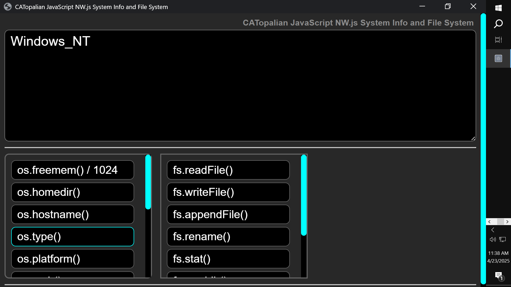

# CATopalian JavaScript NW.js System Info and File System
A JavaScript NW.js Node.js application that teaches System Info and File System functions of Node.js.

---

---

REQUIREMENTS:

NW.js  
https://nwjs.io/  

---

To run this application we:
* Download NW.js
* Extract All
* Find the nw.exe icon
* Drag the src folder onto the nw.exe icon  

Full Instructions on Running ourFirstApp here: https://github.com/ChristopherAndrewTopalian/CATopalian_JavaScript_NW.js

---

### How to Download this App
1. Click the green Code Button on this github page
2. Choose Download ZIP
3. Save the Zip File
4. Extract All
5. Double click the HTML file to start the App

---

Happy Scripting :-)

